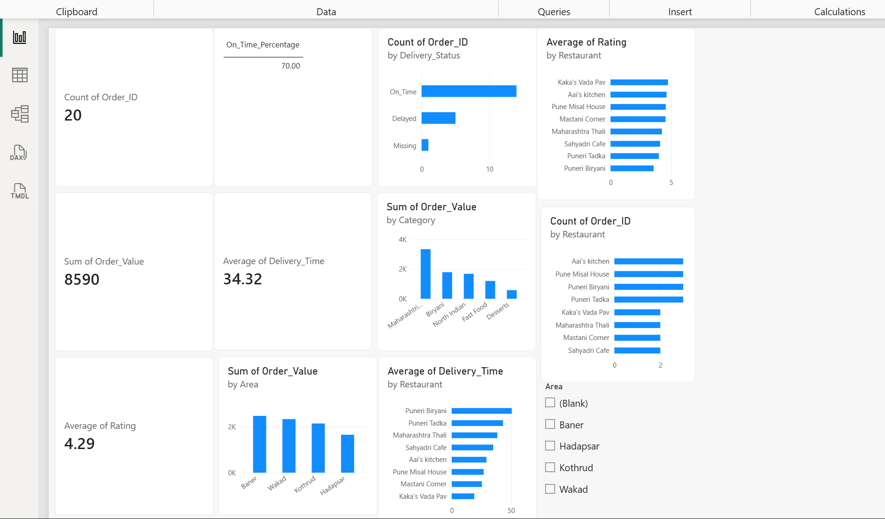

# Food Delivery Analytics

## Project Overview

This project analyzes a simulated food delivery dataset using Excel, SQL, Python and Power BI.

The goal is to understand order patterns, revenue, customer behavior, restaurant performance and delivery performance.

## Tools Used
- Excel – Data cleaning and basic analysis
- SQL – Data querying and business analysis
- Python (Pandas) – Data analysis
- Power BI – Interactive dashboard

## Business Questions
- Which areas generate the most revenue?
- Which restaurants receive the most orders?
- Which food categories generate the most revenue?
- Which customers are repeat customers?
- What is the average delivery time?
- How many orders are delayed or on time?
- Which restaurants have higher average ratings?

## Key Insights
- Total Orders: 20
- Total Revenue: ₹8,590
- Average Rating: 4.29
- Average Delivery Time: 34.32 minutes
- On-Time Delivery: 70%
- Maharashtrian category generated the highest revenue.
- Puneri Biryani generated the highest restaurant revenue.

## Dashboard

## Project Structure
Food-Delivery-Analytics/
├── SQL/
│   └── food_delivery_analysis.sql
├── food_delivery_analysis.py
├── food_delivery_raw_data.xlsx
├── Food_Delivery_Analytics_Dashboard.pbix
├── Food_Delivery_Analytics_Dashboard.png
└── README.md
